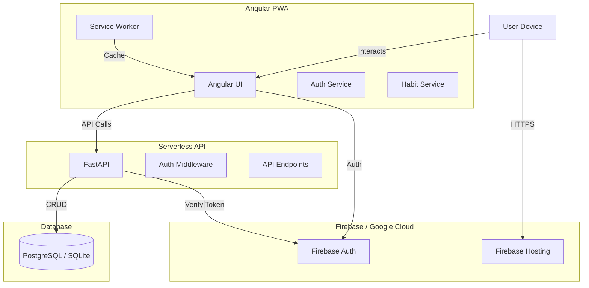

# 🏗️ HabitBuddy Architecture

HabitBuddy is a **Progressive Web Application (PWA)** designed for habit tracking, built with a modern serverless architecture.

## 🧩 System Overview

## 🛠️ Tech Stack

| Component | Technology | Purpose |
|-----------|------------|---------|
| **Frontend** | Angular 17+ | Core application framework |
| **Styling** | SCSS, Lucide | UI styling and icons |
| **PWA** | Service Worker | Offline support, installability |
| **Backend** | Python FastAPI | REST API for complex logic |
| **Database** | PostgreSQL / SQLite | Relational data storage |
| **Auth** | Firebase Auth | User identity management |
| **Hosting** | Firebase (FE) | Deployment infrastructure |

## 📂 Component Details

### 1. Frontend (Angular)
Located in `projects/habit-buddy/src/app`
- **Features**: Modular architecture (`features/` directory)
    - `dashboard`: Main view
    - `habits`: CRUD and management
    - `calendar`: History view
    - `statistics`: D3.js visualizations
- **State Management**: Reactive services using RxJS and Signals.
- **Offline First**: Firestore offline persistence + Service Worker caching.

### 2. Backend (FastAPI)
Located in `backend/`
- **Entry Point**: `main.py`
- **Role**:
    - Validates complex business logic.
    - Provides REST endpoints for external integrations.
    - Acts as a secure gateway to Firestore for admin tasks.
- **Security**: Validates Firebase ID Tokens on every request.

### 3. Data Model (SQL)
Relational Schema (PostgreSQL/SQLite):

- **Users Table** (`users`)
    - `id` (PK, String): Firebase UID
    - `email` (String)
    - `display_name` (String)

- **Habits Table** (`habits`)
    - `id` (PK, UUID)
    - `user_id` (FK -> users.id)
    - `title` (String)
    - `color` (String)
    - `days_target` (Integer)

- **CheckIns Table** (`check_ins`)
    - `id` (PK, UUID)
    - `habit_id` (FK -> habits.id)
    - `check_in_date` (DateTime)

- **Reminders Table** (`reminders`)
    - `id` (PK, UUID)
    - `habit_id` (FK -> habits.id)
    - `time` (String)
    - `days` (JSON Array)

## 🔄 Key Workflows

### Authentication
1. User signs in via Angular UI (Google/Email).
2. Firebase returns an **ID Token**.
3. Frontend attaches this token to API requests (`Authorization: Bearer <token>`).
4. Backend verifies token with Firebase Admin SDK.

### Data Synchronization
- **Real-time**: Frontend subscribes to Firestore `onSnapshot` for live updates.
- **Offline**: Writes go to local cache first, synced to cloud when online.

## ☁️ Hosting Strategy (Optimized)

We utilize a **Hybrid Serverless** approach to maximize performance and minimize cost.

### 1. Frontend: Firebase Hosting
- **Role**: Serves the Angular PWA static assets.
- **Optimization**:
    - **CDN**: Assets distributed globally via Google's CDN.
    - **Caching**: Aggressive caching headers for JS/CSS.
    - **SPA Rewrites**: Configured to handle Angular routing.
- **Config**: `firebase.json`

