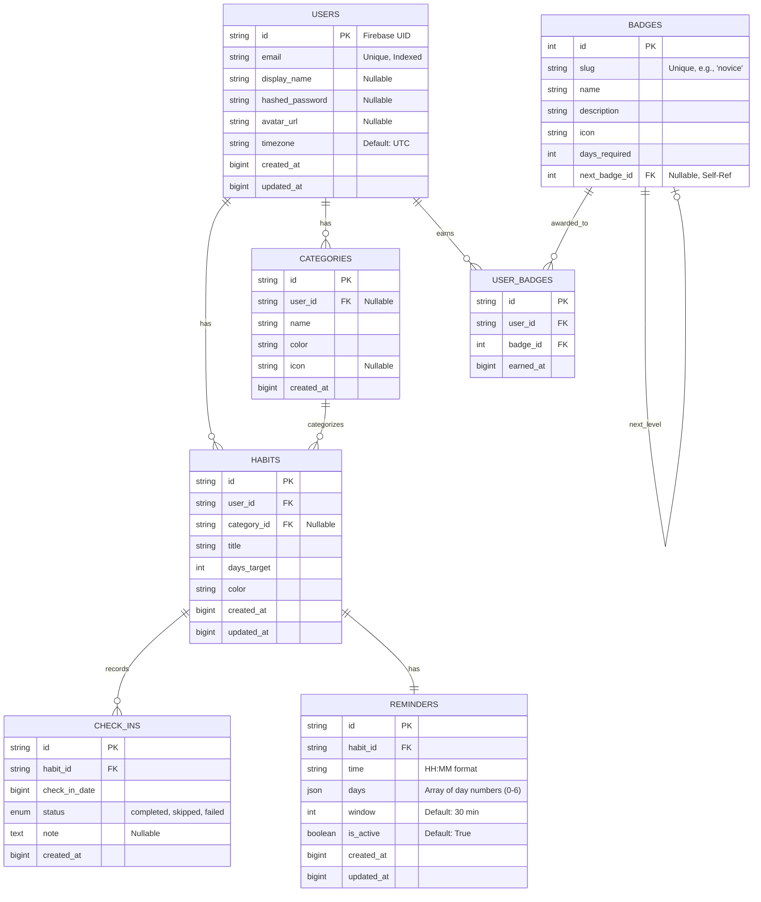

# Database Schema Documentation

This document describes the database schema for the Habit Buddy application. The application uses **PostgreSQL** as the database backend and **SQLAlchemy** as the ORM.

## Overview

- **Database System**: PostgreSQL
- **ORM**: SQLAlchemy
- **Declarative Base**: Defined in `backend/app/database.py`

## Entity-Relationship Diagram (ERD)

## Tables Definition

### 1. Users (`users`)
Stores user account information.
- **id** (`String`, PK): Firebase UID.
- **email** (`String`, Unique): User's email address.
- **display_name** (`String`): User's display name.
- **hashed_password** (`String`): For native auth (nullable).
- **avatar_url** (`String`): URL to user's avatar.
- **timezone** (`String`): User's timezone (default "UTC").
- **created_at** (`BigInteger`): Timestamp (ms).
- **updated_at** (`BigInteger`): Timestamp (ms).

### 2. Categories (`categories`)
Groups habits together.
- **id** (`String`, PK): Unique identifier.
- **user_id** (`String`, FK -> `users.id`): Owner of the category. Nullable for global categories.
- **name** (`String`): Category name.
- **color** (`String`): Hex color code.
- **icon** (`String`): Icon name/URL.
- **created_at** (`BigInteger`): Timestamp (ms).

### 3. Habits (`habits`)
The core entity representing habits to be tracked.
- **id** (`String`, PK): Unique identifier.
- **user_id** (`String`, FK -> `users.id`): Owner of the habit.
- **category_id** (`String`, FK -> `categories.id`): Associated category (nullable).
- **title** (`String`): Name of the habit.
- **days_target** (`Integer`): Target number of days.
- **color** (`String`): Hex color code.
- **created_at** (`BigInteger`): Timestamp (ms).
- **updated_at** (`BigInteger`): Timestamp (ms).

### 4. Check-Ins (`check_ins`)
Records daily progress for habits.
- **id** (`String`, PK): Unique identifier.
- **habit_id** (`String`, FK -> `habits.id`): The habit being checked in.
- **check_in_date** (`BigInteger`): Timestamp (ms) representing the date of check-in.
- **status** (`Enum`): 'completed', 'skipped', or 'failed'.
- **note** (`Text`): Optional note for the check-in.
- **created_at** (`BigInteger`): Timestamp (ms).

### 5. Reminders (`reminders`)
Configuration for habit notifications.
- **id** (`String`, PK): Unique identifier.
- **habit_id** (`String`, FK -> `habits.id`): The habit to remind for.
- **time** (`String`): Time in "HH:MM" format.
- **days** (`JSON`): List of days of the week (0-6) valid for the reminder.
- **window** (`Integer`): Notification window in minutes.
- **is_active** (`Boolean`): Toggle for the reminder.
- **created_at** (`BigInteger`): Timestamp (ms).
- **updated_at** (`BigInteger`): Timestamp (ms).

### 6. Badges (`badges`)
Gamification elements.
- **id** (`Integer`, PK): Unique numeric identifier.
- **slug** (`String`, Unique): Textual identifier for code mapping (e.g., 'novice').
- **name** (`String`): Badge name.
- **description** (`String`): Description of the achievement.
- **icon** (`String`): Icon identifier.
- **days_required** (`Integer`): Number of days required to earn this badge.
- **next_badge_id** (`Integer`, FK -> `badges.id`): Identifier of the following badge.

### 7. User Badges (`user_badges`)
Join table for Users and Badges to track earned achievements.
- **id** (`String`, PK): Unique identifier.
- **user_id** (`String`, FK -> `users.id`): The user who earned the badge.
- **badge_id** (`Integer`, FK -> `badges.id`): The badge earned.
- **earned_at** (`BigInteger`): Timestamp (ms).

## Data Types Note
- Timestamps are stored as `BigInteger` representing milliseconds since epoch to maintain consistency with frontend JavaScript dates.
- IDs are generally `String` (likely UUIDs), except for `users.id` which comes from Firebase, and `badges.id` which is Numeric.
